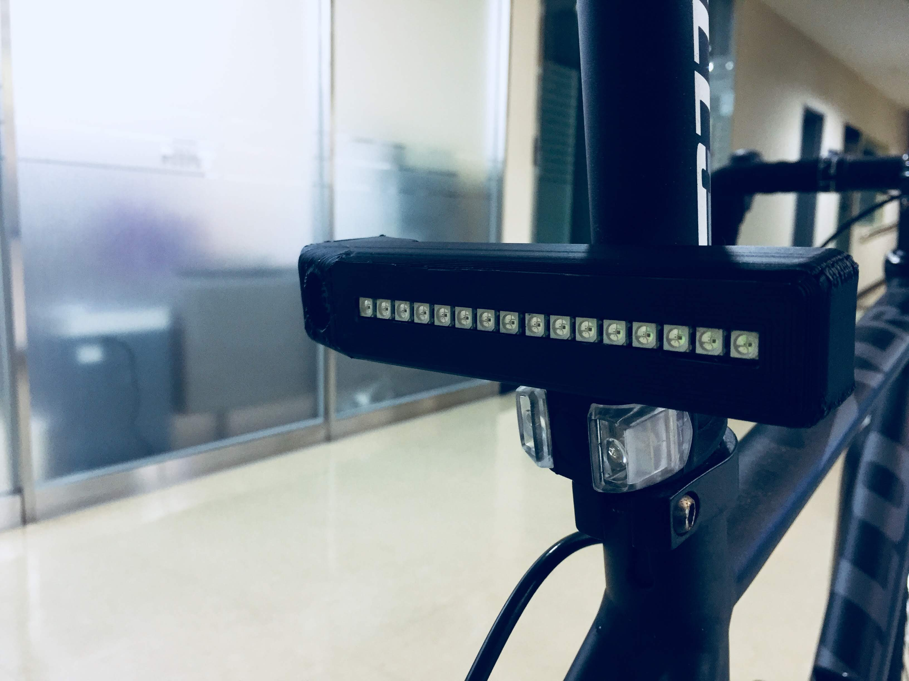
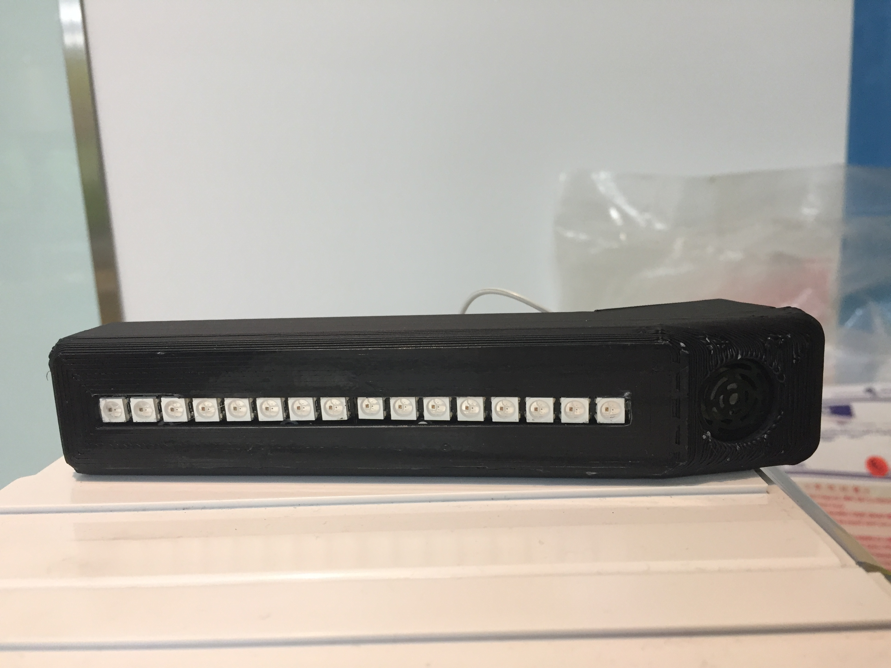
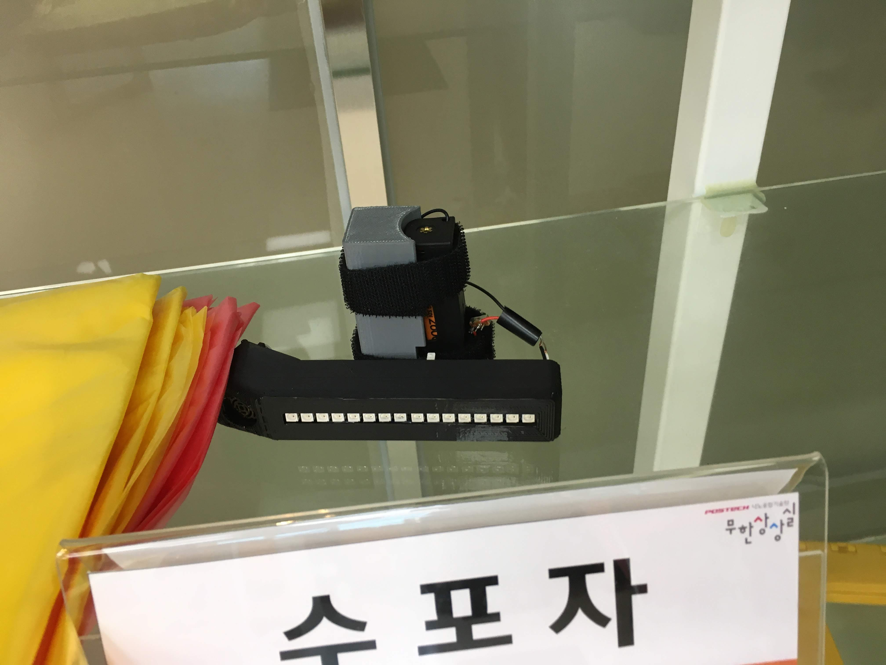

# NewSense
Smart Back Light System for bike that uses UltraSonicSensor to sense the car coming from behind your bike and warns you

# Purpose
This idea was created for bike rider. I use to be a rider. So I know that looking back while riding bike is really dangerous.
Backlight will sense the car coming from behind rider and alart rider and driver coming behind you

# Result
I made this simple prototype mock up. It senses distance by using ultra sonic sensor & indicates driver by various patterns of led indicating method

Later that prototype I went to Hack - A - Thon competition, held by POSTECH.

